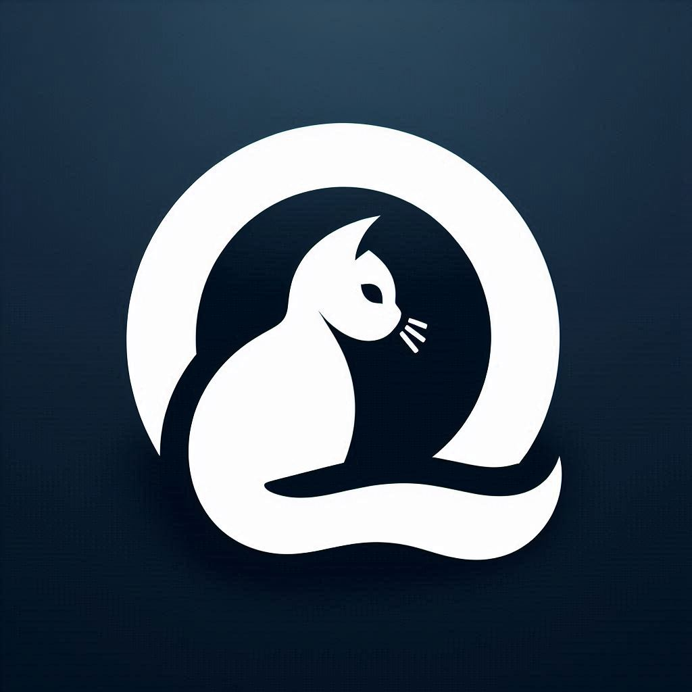

# QuantumQat
[](https://github.com/alfredgamulo/quantumqat/actions/workflows/build.yml)

The purpose in building this image is to cater to people who identify as gamers first, and as hackers second.

This repository builds a custom Universal Blue image. THANK YOU to the giants that work on the Universal Blue Projects:
- [Bazzite](https://bazzite.gg/)
- [Universal Blue](https://github.com/ublue-os)

# How to Use

## Workflow

This repository has a GitHub workflow that automatically builds and publishes the container image to GitHub Container Registry.

## Rebasing

If you are already running a vanilla installation of any Universal Blue system, then you can rebase to this image by running

```bash
rpm-ostree rebase ostree-image-signed:docker://ghcr.io/alfredgamulo/quantumqat:latest
```

## ISO

You can build an [ISO](https://blue-build.org/learn/universal-blue/#fresh-install-from-an-iso) for offline installation by running

```bash
just build-iso
```

# Verification

These images are signed with [sigstore](https://www.sigstore.dev/)'s [cosign](https://github.com/sigstore/cosign). You can verify the signature by downloading the `cosign.pub` file from this repo and running the following command:

```bash
cosign verify --key cosign.pub ghcr.io/alfredgamulo/quantumqat
```
